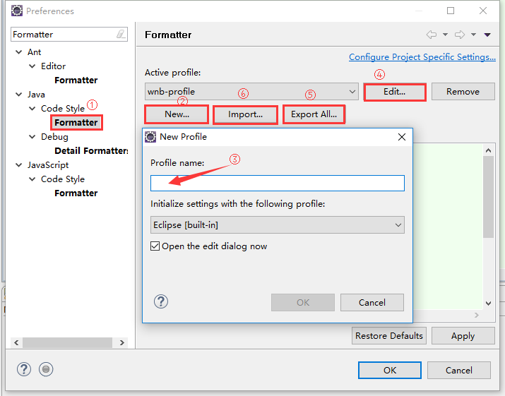

 团队编码规范 v0.0（草案）
======================

1 目的
-------

软件项目生命周期中，绝大部分工作是在维护，意味着代码可能被反复阅读和修改，并且代码的维护者和创建者很可能不是同一个人。  
因此，团队统一的编码规范能使代码整体风格更一致，可读性更高，更易于维护。
为实现以上目的，参考JDK源码，制定本规范。  
（**目前是草案，等待修订**）

2 命名
------

命名应当使用有意义的英文，不应当使用缩写，除非是众所周知的缩写词汇。原则上不应当使用中文拼音，如果确实需要，应当使用全拼，并且加上相应注释。  
命名规则使用驼峰法（Camel-Case）

####类（class）
类名应当使用名词或名词短语，每个单词的首字母大写，其他字母小写。
如果是抽象类，可考虑使用Abstract作为前缀。
如果是子类，可考虑使用其父类名作为后缀，Exception的子类应当使用Exception作为后缀。

####接口（interface）
接口名应当使用名词或形容词，每个单词的首字母大写，其他字母小写。

####字段（field）
字段名应当使用名词或名词短语，第一个单词全小写，其后每个单词的首字母大写，其他字母小写。

####方法（method）
方法名应当使用动词或动词短语，第一个单词全小写，其后每个单词的首字母大写，其他字母小写

####常量（constant）
Java常量以static final 字段的形式存在，常量名应当使用名词或名词短语，全字母大写，单词之间使用下划线(`_`) 分隔。

####枚举（enum）
枚举类型也是类，参考类命名规范，枚举值参考常量。

####变量（variable）
变量名应当使用有意义的词汇，第一个单词全小写，其后每个单词的首字母大写，其他字母小写。

3 格式
-------

####缩进
由于在使用不同的源代码管理工具时Tab字符将因为用户设置的不同而扩展为不同的宽度，推荐的做法是只使用空格作为缩进，缩进宽度为4个字符。  
Eclipse可以通过设置，在按下Tab键时插入4个空格，如下图
  
（**由于Eclipse默认使用Tab作为缩进，并且项目现存代码大量使用Tab作为缩进，所以这条待定**）

####大括号
开括号（左括号）紧跟在前一个语法元素的后面，其后跟一个换行，闭括号（右括号）应当独占一行，并且与对应开括号所在行的行首保持相同的缩进。  
但是以下情况是例外：  

* 数组初始化的大括号，如：  
		
		String[] array = new String[]{"","",""};  
		
* `else`前的闭括号, 如：   
		
		if(condition){
			statements;
		} else {
			statements;
		}

* `do-while`语句的闭括号，如：  

		do{
			statements;
		} while(condition);

* `try-catch-finally`语句的闭括号，如：  

		try{
			statements;
		} catch (Exception e) {
			statements;
		} finally{
			statements;
		}

####小括号
当一个语句有多个运算符时，应当使用小括号明确指出运算顺序，不能依赖Java的运算符优先级。

4 注释
-----
####Javadoc
类、接口、方法的定义应当添加Javadoc注释，类、接口注释应当对其用途进行说明，方法注释应当对其用途、参数、返回值进行说明

####块注释

####行注释

5 建议
-------

####声明靠近使用
变量应当尽可能在内层声明，使得变量的作用域尽可能小，并且在源代码文件中，变量声明语句应当尽量靠近变量被使用的语句，使得声明与使用在逻辑上更为紧密，
利于阅读与提取子模块。

####控制方法长度
过长的方法不利于阅读，良好风格的代码，方法长度应当控制在一屏（约50~60行）之内。对于过长方法，应当考虑将其中逻辑较为紧密的部分提取为更小的方法，
并给予恰当的命名。细粒度的方法更容易理解、复用、测试以及定位问题。

####控制嵌套深度

####控制访问权限
封装性是面向对象编程基本特征之一，模块内部应当对外隐藏实现细节，只开放必要的接口。  
新建类、方法、字段时，默认应当使用private，只有当确实有必要开放给外界时，才提升访问权限到protected、default（package）、public。

####防御性编程
防御性编程是指为了保障程序运行在预期条件下，而主动对非预期条件进行检查，如果发现非预期条件则提前结束程序（从方法返回、跳出循环、抛出异常等）

####自动格式化
手动调整代码格式耗费精力同时容易产生遗漏，开发工具为我们提供了自动格式化功能，可以节省很多时间，但是使用之前应当进行必要的设置。  

以Eclipse为例：  
打开菜单Window->Preference，选择Java->Code Style->Formatter，点击New...新建一个配置，输入配置名称，然后点击Edit...打开配置编辑页面，
编辑完成后可以导出配置文件，团队成员可以导入同一份配置文件，保证团队的代码格式统一。  
  

