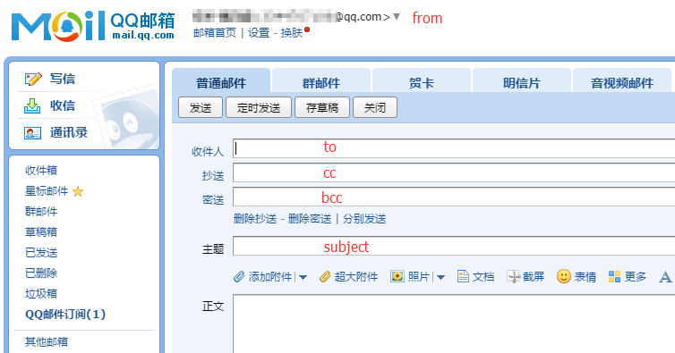
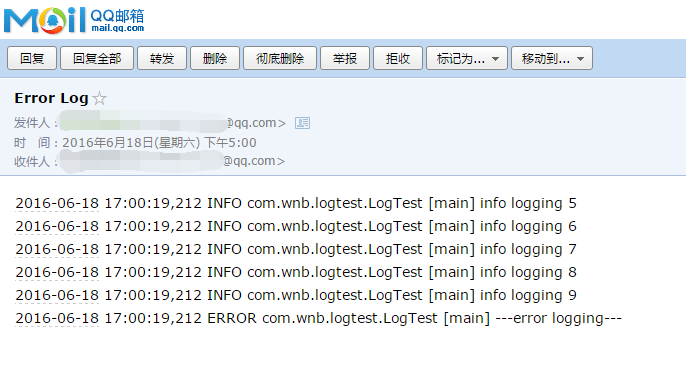

Log4j 2.6.1 SMTPAppender发送错误日志到QQ邮箱
=======================================

log4j2的SMTPAppender支持以SMTP协议发送日志到邮件，当系统出现错误时，可以用这种方式及时通知相关人员。

由于公司使用QQ作为日常工作的沟通工具，所以我尝试将日志发送到QQ邮箱。

官方文档
--------

先看一下SMTPAppender的官方文档以及示例：

<table border="0" class="bodyTable"><caption align="top">SMTPAppender Parameters</caption>
            
            
<tr class="a">
              
<th>Parameter Name</th>
              
<th>Type</th>
              
<th>Description</th>
            </tr>
            
<tr class="b">
              
<td>bcc</td>
              
<td>String</td>
              
<td>The comma-separated list of BCC email addresses.</td>
            </tr>
            
<tr class="a">
              
<td>cc</td>
              
<td>String</td>
              
<td>The comma-separated list of CC email addresses.</td>
            </tr>
            
<tr class="b">
              
<td>bufferSize</td>
              
<td>integer</td>
              
<td>The maximum number of log events to be buffered for inclusion in the message. Defaults to 512.</td>
            </tr>
            
<tr class="a">
              
<td>filter</td>
              
<td>Filter</td>
              
<td>A Filter to determine if the event should be handled by this Appender. More than one Filter
                may be used by using a CompositeFilter.
              </td>
            </tr>
            
<tr class="b">
              
<td>from</td>
              
<td>String</td>
              
<td>The email address of the sender.</td>
            </tr>
            
<tr class="a">
              
<td>layout</td>
              
<td>Layout</td>
              
<td>The Layout to use to format the LogEvent. The default is SerializedLayout.</td>
            </tr>
            
<tr class="b">
              
<td>name</td>
              
<td>String</td>
              
<td>The name of the Appender.</td>
            </tr>
            
<tr class="a">
              
<td>replyTo</td>
              
<td>String</td>
              
<td>The comma-separated list of reply-to email addresses.</td>
            </tr>
            
<tr class="b">
              
<td>smtpDebug</td>
              
<td>boolean</td>
              
<td>When set to true enables session debugging on STDOUT. Defaults to false.</td>
            </tr>
            
<tr class="a">
              
<td>smtpHost</td>
              
<td>String</td>
              
<td>The SMTP hostname to send to. This parameter is required.</td>
            </tr>
            
<tr class="b">
              
<td>smtpPassword</td>
              
<td>String</td>
              
<td>The password required to authenticate against the SMTP server.</td>
            </tr>
            
<tr class="a">
              
<td>smtpPort</td>
              
<td>integer</td>
              
<td>The SMTP port to send to. </td>
            </tr>
            
<tr class="b">
              
<td>smtpProtocol</td>
              
<td>String</td>
              
<td>The SMTP transport protocol (such as &quot;smtps&quot;, defaults to &quot;smtp&quot;).</td>
            </tr>
            
<tr class="a">
              
<td>smtpUsername</td>
              
<td>String</td>
              
<td>The username required to authenticate against the SMTP server.</td>
            </tr>
            
<tr class="b">
              
<td>ignoreExceptions</td>
              
<td>boolean</td>
              
<td>The default is <tt>true</tt>, causing exceptions encountered while appending events to be
                internally logged and then ignored. When set to <tt>false</tt> exceptions will be propagated to the
                caller, instead. You must set this to <tt>false</tt> when wrapping this Appender in a
                <a href="http://logging.apache.org/log4j/2.x/manual/appenders.html#FailoverAppender">FailoverAppender</a>.</td>
            </tr>
            
<tr class="a">
              
<td>to</td>
              
<td>String</td>
              
<td>The comma-separated list of recipient email addresses.</td>
            </tr>
          </table>

	<?xml version="1.0" encoding="UTF-8"?>
	<Configuration status="warn" name="MyApp" packages="">
	  <Appenders>
	    <SMTP name="Mail" subject="Error Log" to="errors@logging.apache.org" from="test@logging.apache.org"
	          smtpHost="localhost" smtpPort="25" bufferSize="50">
	    </SMTP>
	  </Appenders>
	  <Loggers>
	    <Root level="error">
	      <AppenderRef ref="Mail"/>
	    </Root>
	  </Loggers>
	</Configuration>

配置项作用
--------- 
* 邮件元素与配置项的对应关系：  
  

* 根据[这个链接](http://kf.qq.com/faq/120322fu63YV130422nqIrqu.html)的指示  
smtpHost="smtp.qq.com"  
smtpPort="465"或"587"  

* smtpProtocol  
 默认是"smtp"，由于QQ邮箱使用SSL连接，所以要将其设置为"smtps"
  
* smtpUsername  
 就是发件QQ的号码

* smtpPassword  
 需要注意的是，这并不是QQ密码，需要填入QQ邮箱为SMTP服务提供的授权码，关于什么是授权码，参考[这里](http://service.mail.qq.com/cgi-bin/help?subtype=1&&no=1001256&&id=28)

* bufferSize  
 文档说这个表示日志的最大缓存条数，默认512。  
 起初，我以为意思是说log4j在真正发送邮件之前会先缓存日志，当缓存达到上限之后再发送，然而并不是这样的。  
 在默认情况下，只有ERROR或者更高级别的日志才会触发SMTPAppender发送邮件，即使引用SMTPAppender的那个Logger的级别低于ERROR。在这种情况下，日志级别高于Logger的级别但是低于ERROR的日志将会写入到缓存，随着下一次触发邮件发送的日志一起发送。  
 比如我把bufferSize设为5，然后产生10条INFO日志，不会触发邮件发送，这时再产生一条ERROR日志，就会将前面10条INFO日志中最近的5条和这条ERROR日志一起发送到目标邮箱。  
 所以，这里bufferSize可以理解为随着高级别日志一起被发送的低级别日志的最大数量。

测试
------
最后配置完的配置文件大概是这个样子的：  

	<?xml version="1.0" encoding="UTF-8"?>
	<Configuration status="warn" name="MyApp" packages="">
		<Appenders>
			<Console name="STDOUT" target="SYSTEM_OUT">
				<PatternLayout pattern="%d %p %c [%t] %m%n" />
			</Console>
			<SMTP name="Mail" subject="Error Log" to="***@qq.com" from="***@qq.com"
				smtpHost="smtp.qq.com" smtpPort="465" smtpProtocol="smtps"
				smtpUsername="***" smtpPassword="***" bufferSize="5">
				<PatternLayout>
					<Pattern>%d %p %c [%t] %m%n</Pattern>
				</PatternLayout>
			</SMTP>
		</Appenders>
		<Loggers>
			<Root level="all">
				<AppenderRef ref="STDOUT" />
				<AppenderRef ref="Mail" />
			</Root>
		</Loggers>
	</Configuration>

在JUnit里测试一下  

	public class LogTest {
	
		private Logger log = LogManager.getLogger(this.getClass());
	
		@Test
		public void test() {
			for (int i = 0; i < 10; i++) {
				log.info("info logging " + i);
			}
			log.error("---error logging---");
		}
	}

运行后收到了邮件  
